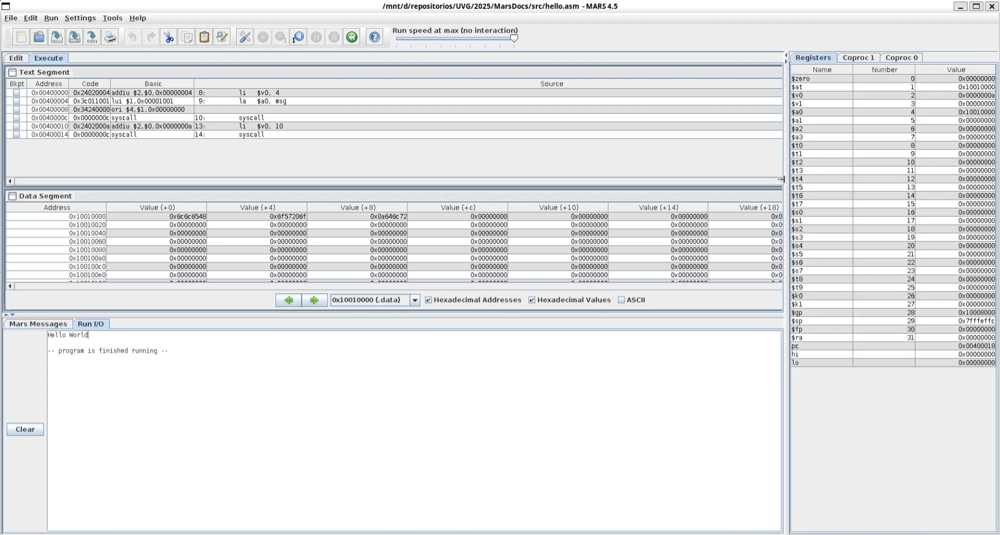

# Documentación MARS

El programa **“Hello World”** en MIPS define en la sección `.data` una cadena llamada `msg` y en la sección `.text` implementa la rutina `main`. Primero se carga el número de servicio **4** en `$v0` (imprimir cadena) y la dirección de `msg` en `$a0`, luego ejecuta **`syscall`** para mostrar el texto y finalmente, se carga **10** en `$v0` y llamo a **`syscall`** otra vez para finalizar el programa.

El código realizado es el siguiente

```asm
.data
msg:    .asciiz "Hello World\n"

.text
.globl main
main:
        # imprimir cadena
        li   $v0, 4
        la   $a0, msg
        syscall

        # salir del programa
        li   $v0, 10
        syscall
```



## Enlaces

- [Ver en YouTube](https://youtu.be/s4NPwxSC9r8)
- [Repositorio](https://github.com/JosueSay/MarsDocs)

## Entorno

- **Simulador:** MARS v4.5.1 (.jar)
- **Entorno:** Java OpenJDK 21.0.8
- **Sistema operativo:** Ubuntu 22.04

## Explicación de registros

- **`$v0`** → Contiene el número de servicio del sistema (4 = imprimir texto, 10 = salir).
- **`$a0`** → Apunta a la dirección en memoria donde está la cadena `"Hello World\n"`.
- **`$t0`, `$t1`, etc.** → Registros temporales disponibles si el programa realiza más operaciones.
- La instrucción **`syscall`** usa los valores en estos registros para ejecutar la acción correspondiente en el simulador.

## Parte superior – *Text Segment*

Contiene el código ensamblado línea por línea:

- `li $v0, 4` → carga el servicio de impresión.
- `la $a0, msg` → carga la dirección del mensaje.
- `syscall` → ejecuta la impresión.
- `li $v0, 10` + `syscall` → termina el programa.
  El resaltado amarillo marca la instrucción actual al depurar paso a paso.

## Data Segment

Muestra la cadena almacenada en memoria:

- Las direcciones (`0x10010000`, etc.) contienen los bytes de `"Hello World\n"`.
- Puedo ver la traducción ASCII de los valores hexadecimales.

## Registers (panel derecho)

- `$v0 = 0x00000004` → indica el servicio a ejecutar.
- `$a0` → contiene la dirección del mensaje en memoria.
- Los demás registros permanecen en cero.
  Cuando ejecuto paso a paso, `$v0` cambia a `10` antes de salir.

## Mars Messages (parte inferior)

Indica el resultado del ensamblado:

```bash
Assemble: operation completed successfully.
```

Esto confirma que el código fue ensamblado correctamente y está listo para ejecutarse donde en IO se puede observar el "hello world".
